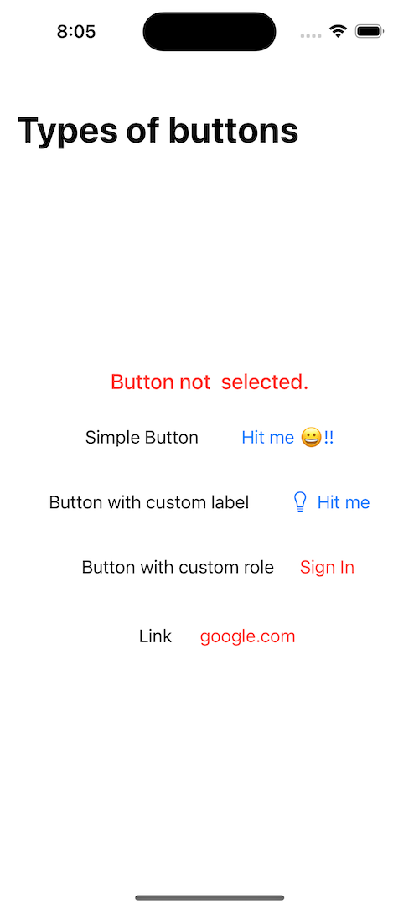

# SwiftUI Button/Link Component 
A control that initiates an action. Implementing a button or link component in SwiftUI is relatively simple and straightforward. 
## Overview
You create a button by providing an action and a label. The action is either a method or closure property that does something when a user clicks or taps the button. The label is a view that describes the button’s action — for example, by showing text, an icon, or both. To implement a button or link component in SwiftUI.

The label of a button can be any kind of view, such as a Text view for text-only labels: 
```
Button {
                        updatedString = "Simple Button selected.."
                    } label: {
                        Text("Hit me 😀!!")
                    }.padding()
```

In SwiftUI, to implement a button or link component, you start by providing an action and a label. The action parameter of a button or link component in SwiftUI is responsible for defining the action to be performed when the user interacts with the button. This action can be defined using a method or closure property. For example, you can define a method that updates a string variable when the button is clicked.

# Link 
To implement a link component in SwiftUI, you can use the `Link` view modifier. The `Link` view modifier allows you to create a hyperlink-like component that, when tapped, navigates the user to another location or external safari browser.

To implement a link component in SwiftUI using the `Link` view modifier, you can specify the destination URL and provide a label for the link. For example, to create a link that opens a URL in the default browser when tapped:
```
                    Link(destination: URL(string: "https://www.google.co.in/")!) {
                        Text("google.com ")
                    }.foregroundColor(.red)
```

