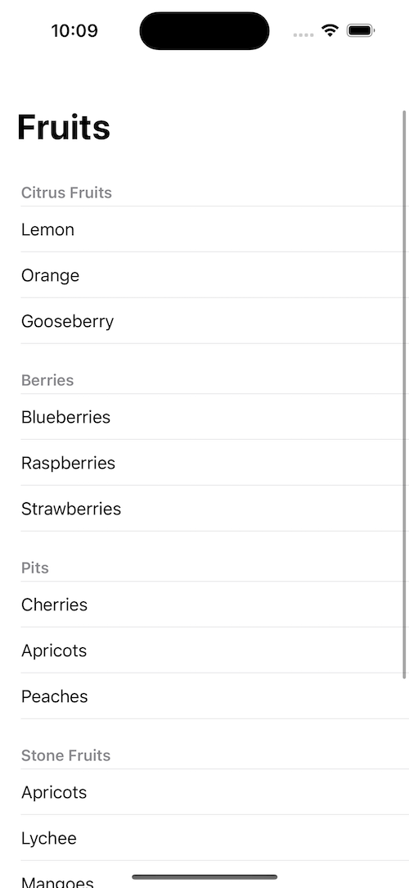

# SwiftUI ListView

This tutorial provides the detail implementation of a listview component in SwiftUI. The List component in SwiftUI allows developers to present data in a structured and organized format, making it an essential tool for creating interactive and visually appealing user interfaces.

### Overview

 By utilizing listview, developers can create dynamic lists that can be scrolled, sorted, and searched, providing an intuitive and user-friendly experience to the app's users. In this tutorial, we will walk you through the process of creating a listview in SwiftUI and demonstrate its various capabilities and customization options.

### Types of list

- Plain
- Grouped

## Reference Image

